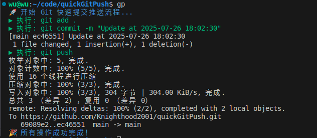
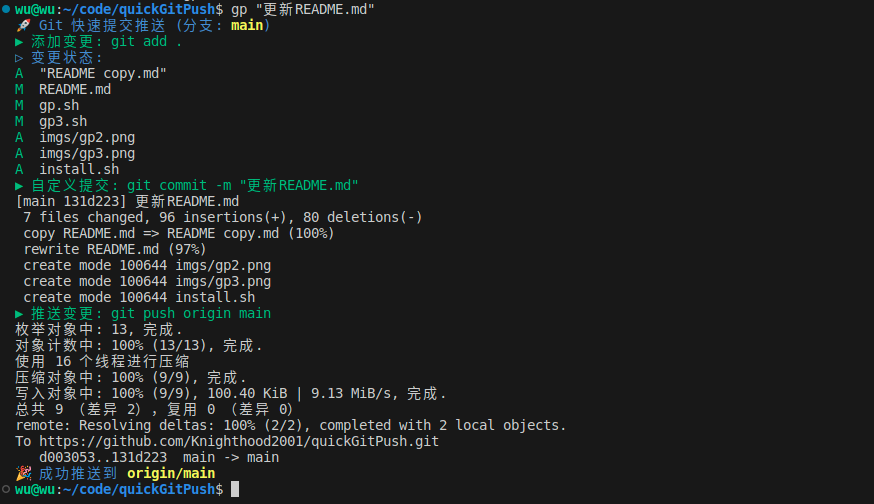

# Git 快速提交推送工具

这是一个简化 Git 提交和推送流程的脚本集合，适用于日常开发中快速提交代码变更。

## 项目目标
- 简化 Git 提交流程，减少重复输入命令的时间（实现三合一：add、commit、push）。
- 通过颜色和状态提示提升用户体验。

## 如何安装

```shell
git clone git@github.com:Knighthood2001/quickGitPush.git
cd quickGitPush
sh install.sh
```
**然后你就可以将这个项目删除了，因为内容已经被拷贝到你的`~/.bashrc`中了。**

## 如何使用

首先就是你有远程分支，并且你已经配置好了远程仓库。然后你更改了本地代码，想要同步到远程分支。

一般的流程是这样的：
```shell
git add .
git commit -m "提交信息"
git push
```

使用这个项目，你可以简化这个过程。只需要输入一行命令。

> **我选用gp，是因为这是git push的缩写。**

你可以选择两种方式使用：
1. 自定义commit message

```bash
gp "提交信息"
```

> 这里的"提交信息"换成你想提交的信息即可。

2. 使用默认时间戳

```bash
gp
```

此时commit的时候，就会使用当前时间戳作为commit message。

输出示例：


## 文件说明

1. **`gp.sh`**
   - 基础版本：提供最简单的 `git add`、`git commit` 和 `git push` 功能。
   - 使用方法：`gp "提交信息"`（如果未提供提交信息，则使用默认时间戳）。

2. **`gp2.sh`**
   - 增强版本：增加颜色标记和状态提示，提升用户体验。
   - 功能：
     - 显示当前分支。
     - 自动检测是否为 Git 仓库。
     - 提供更友好的输出格式。
   - 结果如下：

      

3. **`gp3.sh`**
   - 优化版本：修复了分支名称引用问题，确保 `git push` 正确推送当前分支。
   - 改进点：
     - 使用 `git branch --show-current` 获取分支名称。
     - 修复了 `git push` 命令中分支变量的引用问题。
   - 结果如下：

      


> **这里主要使用的是gp3.sh，因为其最优美，功能最完善**


